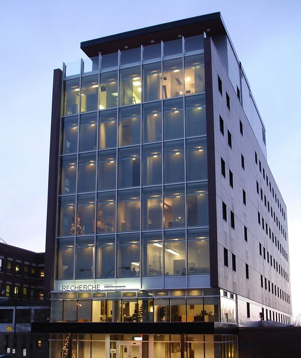

## IntroML Resources @ MAIN 2018

Welcome to the educational workshops @ MAIN 2018! On this page you'll find resources for the courses entitled,

"[Machine learning for neuroimaging with Scikit-learn and nilearn](./course-outline.md),"

and,

"[Deep Learning for Neuroimaging](./dl-course-outline.md)"

Register on [EventBrite](https://www.eventbrite.ca/e/deep-learning-in-neuroimaging-machine-learning-scikit-learn-nilearn-tickets-53388406160){: .btn} !

Join the [brainhack slack](https://brainhack-slack-invite.herokuapp.com/) and the #main-dl-2018 (Dec 11th) and/or #main-nilearn-2018 (Dec 12th) channel. 

Breakfast (8:30 am) and lunch are included. The training sessions will run from 9 am to 5 pm both days. All training sessions will be at the Groupe Maurice amphitheatre, at the [centre de recherche de l'institut de gériatrie de Montréal](https://goo.gl/maps/ouhdXKKWtko). 4545 Queen Mary Rd, Montreal, QC H3W 1W6, Canada. Metro station: snowdon (orange/blue lines), côte-des-neiges (blue line). 


### Usage

To use the docker image, first after cloning the repository and cd to it, build it :
```
sudo docker build --tag=introml .
```
You can now run the container :
```
sudo docker run -p 8888:8888 -it introml jupyter notebook --no-browser --ip=0.0.0.0
```
